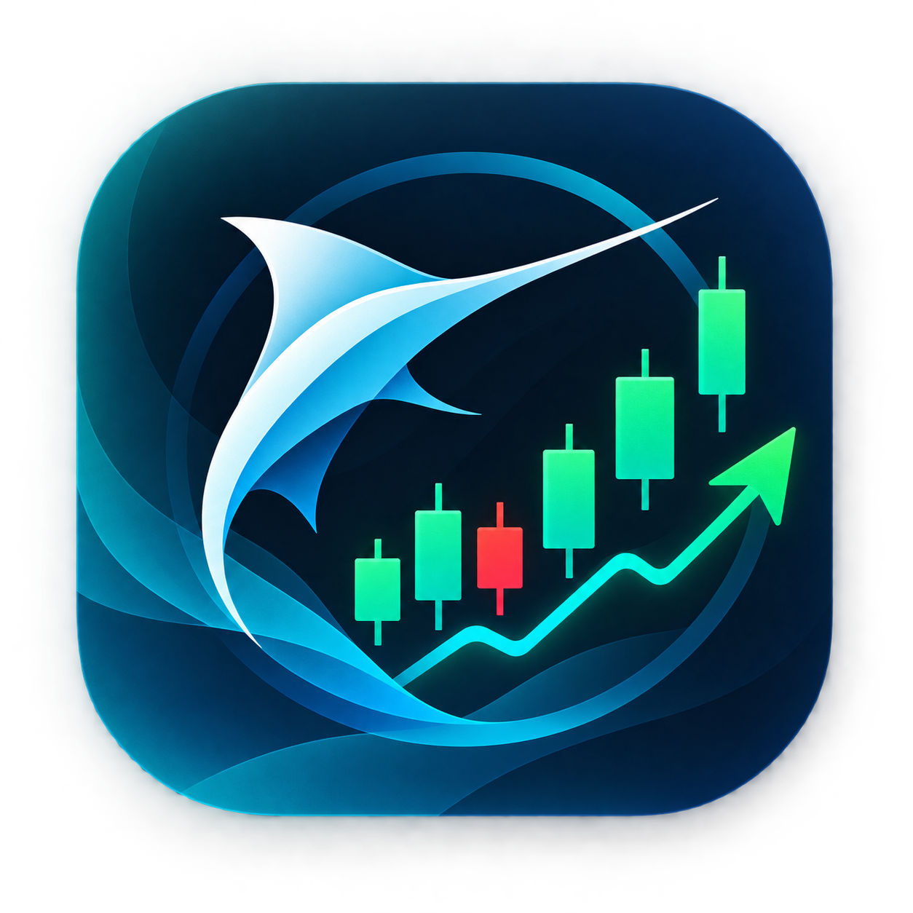
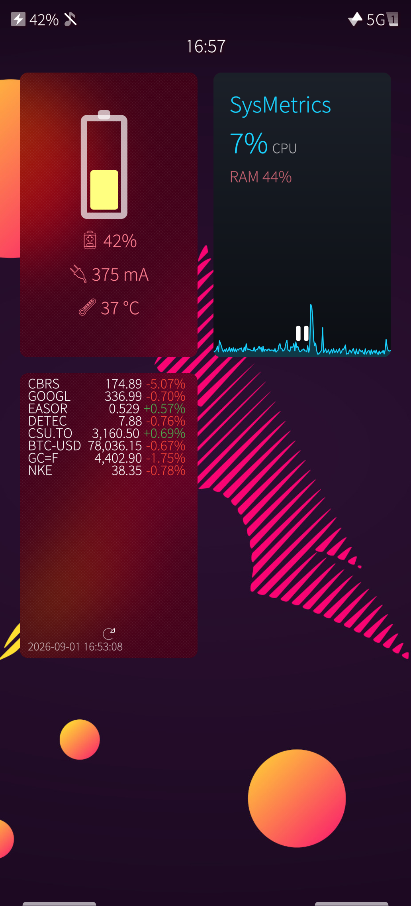
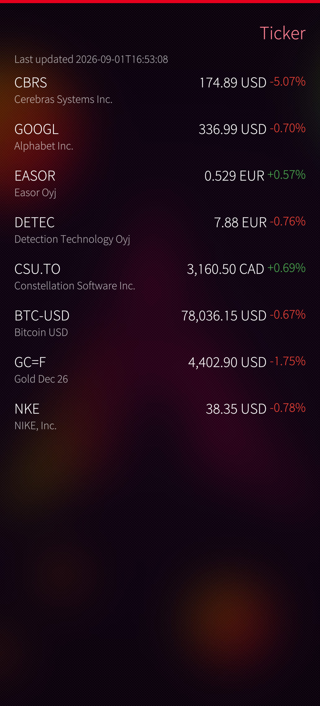

# Harbour Ticker

**Live stock and index tickers on your Sailfish OS cover.**

A native Sailfish Silica app — the cover on the Home screen shows up to 10 tickers with price and day-change, updating every few minutes. Data from Yahoo Finance, no API key needed. Tap the cover action to refresh instantly.

No default tickers on fresh install — add your own via **Browse** (45 curated) or **Add symbol** (`AAPL`, `^GSPC`, `EURUSD=X`, `BTC-USD`).

## Features

- **Cover first** — headerless dense layout (tight margins, scaled rows) fits 10 tickers; timestamp anchored at the bottom.
- **Editable watchlist** — long-press to remove, add any Yahoo symbol (`AAPL`, `^GSPC`, `EURUSD=X`, `BTC-USD`).
- **Browse picker** — curated 45 symbols (US/EU indices, Tech, Helsinki `.HE`, ETFs, FX, Crypto, Commodities) with search and multi-select.
- **Live updates** — configurable refresh interval while the app is running or its cover is active; 429/401 backoff per symbol.
- **Micro stock precision** — prices below 1.0 show 3 decimals (e.g. `0.511`), others show 2 decimals.

## Settings

| Setting | Default | Notes |
|---------|---------|-------|
| Refresh interval | 5 min | 1–30 min, polling interval |
| Cover rows | 5 | 1–10 rows visible on the cover |
| Show timestamp | on | Last updated time at the bottom of the cover |
| Show currency | off | e.g. `USD` suffix next to price |
| Show price | on | Off = % only — more room for symbols |
| Cover scale | 100% | 70–160% row height + font size |

All settings persist across restarts.

## Screenshots

Cover on the Home screen | Main watchlist page
:---:|:---:
 | 

## Installation

1. Download the latest RPM from the [**Releases**](https://github.com/miskahm/harbour-ticker/releases) page (aarch64).
2. Copy it to your phone and install (File Browser / `rpm -Uvh`), or `scp` + `devel-su rpm -Uvh`.

No root daemon, no extra permissions. OpenRepos listing is planned — the GitHub Releases page is the distribution point until then.

## Data

Quotes from Yahoo Finance `v8/finance/chart` (unofficial, keyless). Only a tiny GET per symbol with a `User-Agent` header; change/percent computed locally. If Yahoo changes its API the poller can be swapped without touching the UI.

- Stocks: `AAPL` · Indexes: `^GSPC`, `^NDX`, `^DJI` · FX: `EURUSD=X` · Crypto: `BTC-USD`
- Rate-friendly: cap 20 symbols, 5-min default, exponential backoff.

## License

GPL-3.0-only. Icons from Sailfish.

## Links

- Issues & roadmap: GitHub Issues
- Harbour Ticker on OpenRepos: *coming soon*
